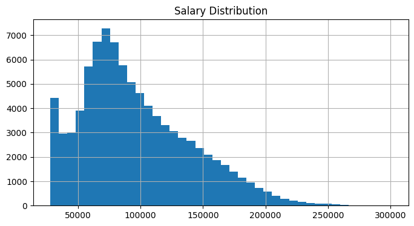
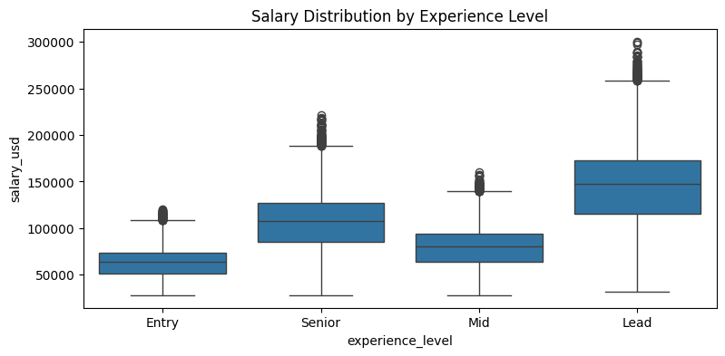
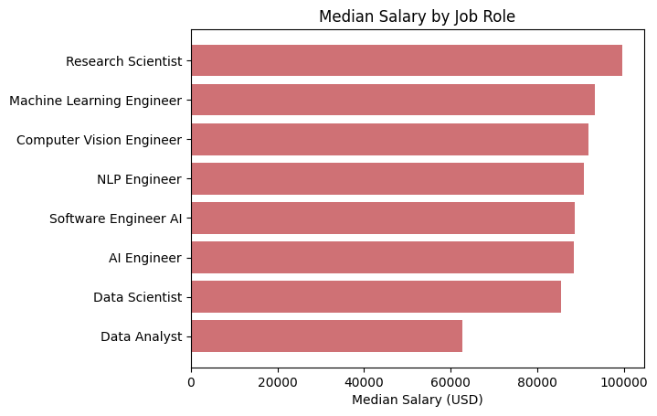
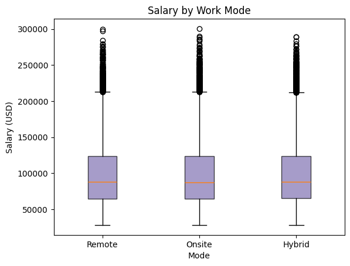
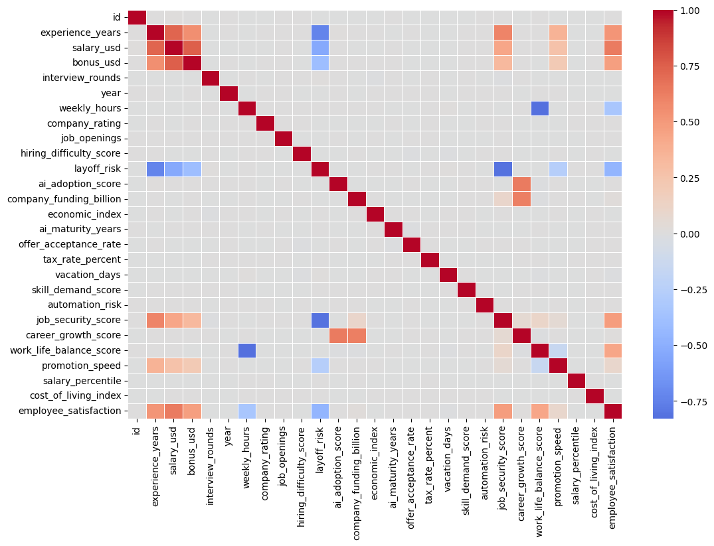

# Global AI, Data Science & Tech Jobs
In this project the dataset on jobs in AI & Data were analyzed and used for machine learning models to predict salary rate among employees. The dataset contains 90 000 rows and 35 columns.

## Data preprocessing
- Most features in the dataset are numerical, but there are also 8 categorical features.
- Categorical features were transformed into numerical representation using encoding techniques: ordinal and one-hot.
- Feature engineering was done to expand the scope of the data.
- Data preparation: splitting data into train and test
- Some columns were removed from the dataset before model fitting since they are derived from target feature.

# Exploratory data analysis
The dataset was investigated through different plots.
## Salary disribution

## Salary distribution over experience level

## Jobs distribituion over countries

## Job positions with highest salaries

## Does the work mode impact the salary rate among employees?

## Correlation heatmap

## Model selection
There were chosen two different ML models: 
- Ridge Regression
- Random Forest.

## Results
Random Forest model predicts significantly better than Ridge, with lower error metrics (MAE, RMSE, MAPE) and higher R² on both training and test sets. However, the gap between training and test data indicates some degree of overfitting. Ridge model demonstrates more consistent behaviour across both datasets, so it has stronger generalization but lower overall accuracy.

